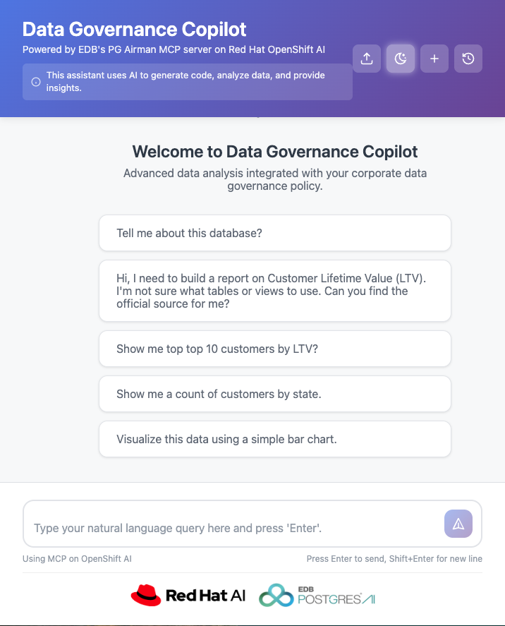
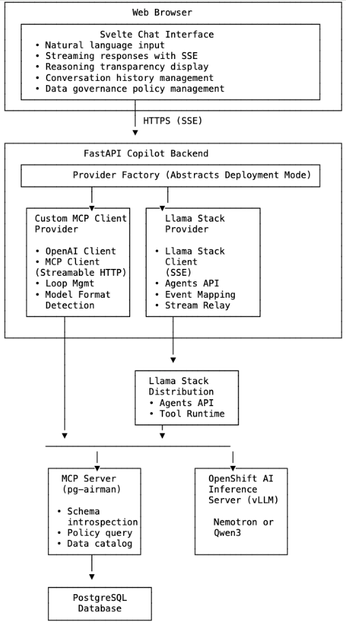

# Build governance aware retail analytics with EDB Postgres AI

Enhance retail discovery with an AI assistant that activates governance for loyalty analytics using secure, policy-aware natural language queries.

## Table of Contents

- [Detailed Description](#detailed-description)
- [Architecture Diagrams](#architecture-diagrams)
- [Requirements](#requirements)
- [Deploy](#deploy)
- [Reference](#reference)
- [Optional technical section](#optional-technical-section)
- [Tags](#tags)

## Detailed Description

The Data Governance Co-Pilot quickstart enables retail organizations to operationalize customer loyalty data without the traditional friction of manual compliance reviews. It demonstrates how a Postgres-MCP-powered AI assistant can navigate the complex, high-stakes data landscape of a large e-commerce enterprise, where analysts often struggle to distinguish "gold-standard" metrics from deprecated or PII-heavy tables. By leveraging Model Context Protocol (MCP) to inspect metadata, verify certifications, and safely execute queries, the assistant transforms a risky, manual discovery process into a secure, automated workflow that ensures compliance and data accuracy. 

Consider a typical e-commerce enterprise where analysts need to work with Customer Lifetime Value (LTV) metrics and transaction history. They must navigate:

- Multiple versions of similar tables (some deprecated, some certified)
- Data classification requirements (PII identification and handling)
- Retention policies and compliance rules
- Access controls that vary by data sensitivity

Traditionally, this knowledge lives in static PDF documents, scattered wikis, or the minds of data owners—making discovery a manual, error-prone process. This quickstart demonstrates how to build an **agentic AI application** that bridges Large Language Models (LLMs) with your enterprise data using **EnterpriseDB's (EDB) pg-airman-mcp**, an open-source Model Context Protocol (MCP) server for PostgreSQL. While this quickstart focuses on e-commerce scenarios, the architectural pattern applies to any vertical:

- **Healthcare**: Navigate HIPAA-protected patient records with compliance awareness
- **FinTech**: Identify certified risk-assessment models and financial data
- **Manufacturing**: Source vetted supply chain telemetry with quality annotations
- **Retail**: Access customer analytics while respecting privacy policies

### See It In Action

_(Videos and demonstrations to be added)_



### Architecture Diagrams



## Requirements

### Minimum Hardware Requirements

- **OpenShift Cluster**: 3+ worker nodes
- **GPU Nodes**: At least 1 node with NVIDIA GPU for LLM inference
  - **Recommended**: NVIDIA A100 (40GB or 80GB VRAM) or L40 (48GB VRAM)
  - **Minimum**: NVIDIA A10 (24GB VRAM)
  - Note: Larger models may require multiple GPUs.
- **Memory**: 32GB RAM minimum per worker node, 64GB recommended for GPU nodes
- **Storage**: 100GB persistent storage for model weights and application data

### Minimum Software Requirements

- **OpenShift Container Platform**: Version 4.20.14 or higher
- **OpenShift AI**: Version 3.2 or higher
  - For Llama Stack mode: Llama Stack operator version 0.3.5.1+rhai0 (included in OpenShift AI 3.2)
  - CRD API version: llamastack.io/v1alpha1
- **NVIDIA GPU Operator**: Required for GPU support on OpenShift
- **Helm**: Version 3.8 or higher
- **oc CLI**: OpenShift command-line tool (version matching cluster)
- **make**: GNU Make utility for deployment automation

## Deploy

1. **Access to OpenShift Cluster**:
   ```bash
   oc login <your-cluster-url>
   ```

2. **Clone the Repository**:
   ```bash
   git clone https://github.com/rh-ai-quickstart/data-governance-co-pilot
   cd data-governance-co-pilot/helm
   ```

3. **Verify OpenShift AI and Llama Stack Versions** (if using llama_stack mode):

   Check Llama Stack CRD API version:
   ```bash
   oc get crd llamastackdistributions.llamastack.io -o jsonpath='{.spec.versions[0].name}'
   # Expected output: v1alpha1
   ```

   Check Llama Stack operator version:
   ```bash
   oc get datasciencecluster default-dsc -o json | \
     jq -r '.status.components.llamastackoperator.releases[] | select(.name == "Llama Stack") | .version'
   # Expected output: 0.3.5.1+rhai0
   ```

4. **Enable Llama Stack Support** (if using llama_stack mode):

   Follow the activation instructions: [Activating the Llama Stack Operator](https://docs.redhat.com/en/documentation/red_hat_openshift_ai_self-managed/3.0/html/working_with_llama_stack/activating-the-llama-stack-operator_rag)

5. **Deploy application**

   IMPORTANT: The make command below will NOT deploy the Nemotron model to your target cluster. You must provide the key, endpoint URL and model-resource-name to an existing nemotron model. There are several other deployment options, however, including those which will automatically deploy a model to your cluster. Please see the 'Model Deployment Options' in [Optional technical section](#optional-technical-section) below for all deployment options.

   ```bash
   make install NAMESPACE=your-namespace \
     DEPLOY_MODEL=false \
     MODEL=nemotron \
     PROVIDER_MODE=mcp_direct \
     postgres.userId=postgres \
     postgres.password=postgres \
     postgres.readonlyPassword=ReadOnly1! \
     postgres.databaseName=postgres \
     llm.apiKey=<your-api-key> \
     llm.baseUrl=https://<model-endpoint>/v1 \
     llm.model=<model-resource-name>
   ```

### Delete

To remove the Data Governance Co-Pilot and all associated resources:

```bash
make uninstall NAMESPACE=$NAMESPACE
```

**Warning**: This command performs a complete cleanup and will delete:
- All application deployments (UI, backend, MCP server, database)
- LlamaStackDistribution resources (if deployed in llama_stack mode)
- Model deployments (if deployed with DEPLOY_MODEL=true)
- All routes, services, secrets, and ConfigMaps
- The namespace itself

This action is irreversible. Ensure you have backups of any important data before running this command.

## Reference

### Model Context Protocol (MCP)

- [MCP Specification](https://modelcontextprotocol.io)
- [pg-airman-mcp Documentation](https://github.com/edb/pg-airman-mcp)

### Red Hat Documentation

- [OpenShift AI Documentation](https://docs.redhat.com/en/documentation/red_hat_openshift_ai_self-managed)
- [OpenShift Container Platform Documentation](https://docs.redhat.com/en/documentation/openshift_container_platform)
- [Llama Stack Operator Guide](https://docs.redhat.com/en/documentation/red_hat_openshift_ai_self-managed/3.0/html/working_with_llama_stack)

### AI Frameworks and Tools

- [Llama Stack Documentation](https://llama-stack.readthedocs.io)
- [vLLM Documentation](https://docs.vllm.ai)
- [KServe Documentation](https://kserve.github.io/website/)

### Model Information

**NVIDIA Nemotron Nano 9B v2**:
- [Model Card on HuggingFace](https://huggingface.co/nvidia/NVIDIA-Nemotron-Nano-9B-v2)
- Tool Calling Format: Custom `<TOOLCALL>` tag format
- Authentication: None required (publicly available)
- Compatible Modes: Custom MCP Client mode only
- vLLM Configuration: See `helm/nemotron-model/` chart

**Qwen3-14B-AWQ**:
- [Model Card on HuggingFace](https://huggingface.co/Qwen/Qwen3-14B-AWQ)
- Tool Calling Format: Standard OpenAI function calling
- Compatible Modes: Both Custom MCP Client and Llama Stack modes
- vLLM Configuration: See `helm/qwen3-model/` chart

## Optional technical section

### Key Capabilities

1. **Understands Governance Policies**: Users upload their data governance policy through the UI, giving the copilot awareness of data classification, retention policies, and access controls
2. **Navigates Metadata**: The copilot uses MCP to inspect database metadata, including custom annotations that map high-level policies to specific tables and columns
3. **Executes Safe Queries**: All database interactions are validated against governance rules and executed through the MCP server
4. **Provides Transparency**: Users can observe the AI's reasoning process as it explores the database and formulates answers (reasoning token generation is only enabled when using the Nemotron model with MCP direct deployment)
5. **Dual MCP Transport Support**: Streamable HTTP (mcp_direct mode) and SSE (llama_stack mode)
6. **Multi-Model Support**: Works with Nemotron and Qwen3 models with automatic format detection
7. **Provider-Based Architecture**: Clean abstraction layer supports both orchestration modes with minimal code duplication

### High-Level Components

The Data Governance Co-Pilot consists of five runtime components:

1. **Web UI (Svelte)**: Modern chat interface with streaming responses and reasoning visualization
2. **Backend Orchestrator (FastAPI)**: Provider-based architecture supporting two orchestration modes
3. **MCP Server (pg-airman-mcp)**: PostgreSQL introspection and query tools exposed via Model Context Protocol
4. **PostgreSQL Database**: PostgreSQL 15 preloaded with sample e-commerce schema and data
5. **Copilot Llama Stack Distribution**: (Llama Stack mode only) Llama Stack CRD and resources managed by OpenShift AI operator

### Technology Stack

- **Frontend**: Svelte 5, TypeScript, TailwindCSS, Server-Sent Events (SSE)
- **Copilot Backend**: Python 3.12, FastAPI
- **LLM Inference**: OpenShift AI inference server using vLLM (v0.11.0)
- **Orchestration**:
  - Custom MCP Client: Supports Nemotron and Qwen3 models
  - Llama Stack: OpenShift AI Llama Stack Operator v0.3.5.1+rhai0 (Qwen3 model)
- **Tools**: Model Context Protocol (MCP) server for PostgreSQL (pg-airman-mcp)
- **Database**: PostgreSQL 15
- **Platform**: OpenShift Container Platform 4.20.14, OpenShift AI 3.2+

### Model Deployment Options

LLM models can be deployed with the quickstart (DEPLOY_MODEL=true) or connect to existing deployments. The quickstart includes two Helm charts for model deployment:

- **nemotron-model**: Deploys NVIDIA Nemotron Nano 9B v2 from HuggingFace
- **qwen3-model**: Deploys Qwen3-14B-AWQ from HuggingFace

Both charts configure KServe InferenceServices on OpenShift AI.

### Optional Components

The quickstart includes two optional components for experimentation:

**MinIO** (object storage):
```bash
DEPLOY_MINIO=true
minio.userId=<username>
minio.password=<password>
```

**pgAdmin** (database administration):
```bash
DEPLOY_PGADMIN=true
pgadmin.email=<email>
pgadmin.password=<password>
```

Note: These optional components are not hardened for production use.

### Deployment Options

The application supports two distinct deployment modes to suit different orchestration needs:

**Custom MCP Client Mode** (mcp_direct)
- A "hands-on" approach where the copilot backend manages the complete agentic loop
- Provides granular control over tool calling, response streaming, and model interaction
- Supports both Nemotron (custom tool format) and Qwen3 (OpenAI function calling) models
- Best for: Organizations wanting full control, custom orchestration logic, or specialized model formats

**Llama Stack Mode** (llama_stack)
- Leverages the OpenShift AI Llama Stack operator for standardized agent orchestration
- Offloads agent management to the emerging Llama Stack framework
- Supports Qwen3 model with standard OpenAI function calling
- Best for: Organizations using OpenShift AI infrastructure and preferring managed orchestration
- Note: Llama Stack in RHOAI is preview technology (version 0.3.5.1+rhai0) and not recommended for production

Supporting both deployment modes provides:

1. **Future-Proofing**: Maintains integration path with the emerging Llama Stack framework as it matures
2. **Risk Mitigation**: Protects against API changes in preview technologies like Llama Stack
3. **Custom Flexibility**: Enables custom orchestration logic for complex requirements that standardized frameworks don't support
4. **Educational Value**: Demonstrates both approaches so teams can make informed architectural decisions

#### Data Sovereignty & Security

Both deployment modes ensure your organization maintains full control over its AI stack. By combining **Red Hat OpenShift** and **OpenShift AI**, you retain sovereignty over:

- **The LLM Model**: Run private models without external API calls or third-party data exposure
- **Inference & Compute**: Keep sensitive data processing within your managed cluster
- **Relational Assets**: Leverage existing PostgreSQL investments while extending utility into AI workflows

The quickstart supports multiple deployment scenarios. Choose the option that matches your requirements:

#### Option 1: Full Installation with Llama Stack Mode (installs Qwen3 Model in your cluster)

**Note**: Llama Stack mode requires version 0.3.5.1+rhai0. Verify version before proceeding (see Prerequisites above).

```bash
make install NAMESPACE=your-namespace \
  DEPLOY_MODEL=true \
  MODEL=qwen3 \
  PROVIDER_MODE=llama_stack \
  postgres.userId=postgres \
  postgres.password=postgres \
  postgres.readonlyPassword=ReadOnly1! \
  postgres.databaseName=postgres
```

This deployment:
- Deploys Qwen3-14B model to OpenShift AI
- Configures Llama Stack Distribution CRD
- Uses Llama Stack for agent orchestration
- Deploys PostgreSQL database with sample data
- Configures all networking and routes

#### Option 2: Llama Stack Mode with External Model; you must provide the details to an already installed qwen 3 model.

Use this when connecting to an existing Qwen3-14B deployment:

```bash
make install NAMESPACE=your-namespace \
  DEPLOY_MODEL=false \
  MODEL=qwen3 \
  PROVIDER_MODE=llama_stack \
  postgres.userId=postgres \
  postgres.password=postgres \
  postgres.readonlyPassword=ReadOnly1! \
  postgres.databaseName=postgres \
  llm.apiKey=<your-api-key> \
  llm.baseUrl=https://<model-endpoint>/v1 \
  llm.model=qwen3-14b
```

**Requirements for external model**:
- Must be Qwen3-14B or compatible model
- Must support OpenAI function calling format
- See `helm/qwen3-model/` for required vLLM configuration flags

#### Option 3: Full Installation with MCP Direct Mode (installs Nemotron Model in your cluster)

```bash
make install NAMESPACE=your-namespace \
  PROVIDER_MODE=mcp_direct \
  DEPLOY_MODEL=true \
  MODEL=nemotron \
  postgres.userId=postgres \
  postgres.password=postgres \
  postgres.readonlyPassword=ReadOnly1! \
  postgres.databaseName=postgres
```

This deployment:
- Deploys NVIDIA Nemotron Nano 9B v2 model
- Uses custom MCP client for agent orchestration
- Enables reasoning transparency features
- Supports Nemotron's custom tool calling format

#### Option 4: Full Installation with MCP Direct Mode (installs Qwen3 Model in your cluster)

```bash
make install NAMESPACE=your-namespace \
  PROVIDER_MODE=mcp_direct \
  DEPLOY_MODEL=true \
  MODEL=qwen3 \
  postgres.userId=postgres \
  postgres.password=postgres \
  postgres.databaseName=postgres
```

#### Option 5: MCP Direct Mode with External Model; you must provide the details to an already installed nemotron model.

**Using Nemotron**:
```bash
make install NAMESPACE=your-namespace \
  DEPLOY_MODEL=false \
  MODEL=nemotron \
  PROVIDER_MODE=mcp_direct \
  postgres.userId=postgres \
  postgres.password=postgres \
  postgres.databaseName=postgres \
  postgres.readonlyPassword=ReadOnly1! \
  llm.apiKey=<your-api-key> \
  llm.baseUrl=https://<model-endpoint>/v1 \
  llm.model=<model-resource-name>
```

**Using Qwen3**:
```bash
make install NAMESPACE=your-namespace \
  DEPLOY_MODEL=false \
  MODEL=qwen3 \
  PROVIDER_MODE=mcp_direct \
  postgres.userId=postgres \
  postgres.password=postgres \
  postgres.databaseName=postgres \
  postgres.readonlyPassword=ReadOnly1! \
  llm.apiKey=<your-api-key> \
  llm.baseUrl=https://<model-endpoint>/v1 \
  llm.model=<model-resource-name>
```

**Note on MODEL parameter**: The `MODEL` parameter (nemotron or qwen3) is a logical identifier that determines model-specific configuration. The `llm.model` parameter is the actual deployed resource name (e.g., "nvidia-nemotron-nano-9b-v2"). When DEPLOY_MODEL=true, llm.model is set automatically.

### Post-Deployment Verification

1. **Get the Application URL**:

   The installation outputs the UI URL. You can also retrieve it:
   ```bash
   echo "https://$(oc get route copilot-ui -n $NAMESPACE -o jsonpath='{.spec.host}')"
   ```

2. **Access the Web Interface**:
   - Navigate to the URL in your browser
   - The chat interface should load

3. **Test Basic Functionality**:
   - Try a sample query: "List all tables in the database"
   - Verify you see streaming responses
   - Check that tool calls are executed (visible in the progress indicators)
   - Confirm results are returned

4. **Test Governance Features**:
   - Upload a sample governance policy using the UI
   - Query: "Which tables contain PII?"
   - Verify the assistant references your policy in responses

### Configuration Options

The Makefile supports the following configuration parameters:

```bash
# Provider mode (required)
PROVIDER_MODE=mcp_direct        # Options: mcp_direct (default), llama_stack

# Model selection (required)
MODEL=nemotron                  # Options: nemotron, qwen3
DEPLOY_MODEL=true               # Options: true (auto-deploy), false (use existing)

# External model configuration (when DEPLOY_MODEL=false)
llm.model=<model-name>          # Model identifier
llm.baseUrl=<endpoint-url>      # vLLM endpoint URL
llm.apiKey=<api-key>            # API key for authentication

# Database credentials (required)
postgres.userId=<username>
postgres.password=<password>
postgres.databaseName=<database>
postgres.readonlyPassword=<password> # For readonly account to db MCP uses
postgres.host=<hostname>             # Optional, defaults to deployed PostgreSQL
postgres.port=5432                   # Optional

# Tool call format (mcp_direct mode only, optional)
llm.toolCallFormat=auto         # Options: auto (default), nemotron, openai
                                # auto: detects from MODEL parameter

# Optional components
DEPLOY_MINIO=true              # Deploy MinIO for object storage
minio.userId=<username>
minio.password=<password>

DEPLOY_PGADMIN=true            # Deploy pgAdmin for database management
pgadmin.email=<email>
pgadmin.password=<password>

# Build vs. Quay image pull based deployment

# By default, all components are deployed from pre-built images stored on Quay.
# This provides several benefits, including faster and less error prone deployments and less compute demain on the target cluster.

# You can optionally deploy the components so they are built directly from the source using OpenShift's buildconfigs and image streams. This option allows you to modify the source code and deploy your changes without requiring a full CI/CD pipeline.

# Each deployment is controlled by a BUILD_X flag, which if set to true, triggers a cluster-side build for the component.

BUILD_DATA_LOADER=true            # Build the data loader on the cluster vs. use Quay image
BUILD_PG_AIRMAN_MCP=true          # Build the pg-airman-mcp component on the cluster
BUILD_COPILOT_UI=true             # Build copilot-ui on the cluster
BUILD_COPILOT_BACKEND=true        # Build copilot-backend on the cluster
```

### Troubleshooting

**GPU Scheduling Issues**:

If model pods fail to schedule with errors like "node(s) had untolerated taint":

1. Check node taints:
   ```bash
   oc describe node <gpu-node-name> | grep Taints
   ```

2. Verify tolerations in Helm chart templates:
   - `helm/nemotron-model/templates/inferenceservice.yaml`
   - `helm/qwen3-model/templates/inferenceservice.yaml`

3. Common GPU taints that need tolerations:
   - `nvidia.com/gpu=true:NoSchedule`
   - `g5-gpu=true:NoSchedule`

**Llama Stack Version Mismatch**:

If Llama Stack deployment fails, verify the operator version matches requirements (0.3.5.1+rhai0). Different versions have breaking API changes.

**Model Loading Failures**:

Check vLLM pod logs for model download or loading issues:
```bash
oc logs -l serving.kserve.io/inferenceservice=<model-name> -n $NAMESPACE
```

## Tags

* **Industry:** Retail
* **Product:** Red Hat OpenShift AI
* **Use Case:** Data Governance and Compliance Automation, Policy enforcement 
* **Partner**: EnterpriseDB
