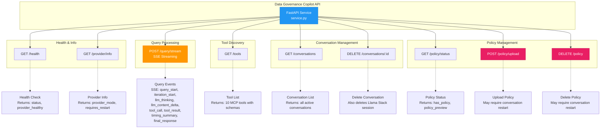
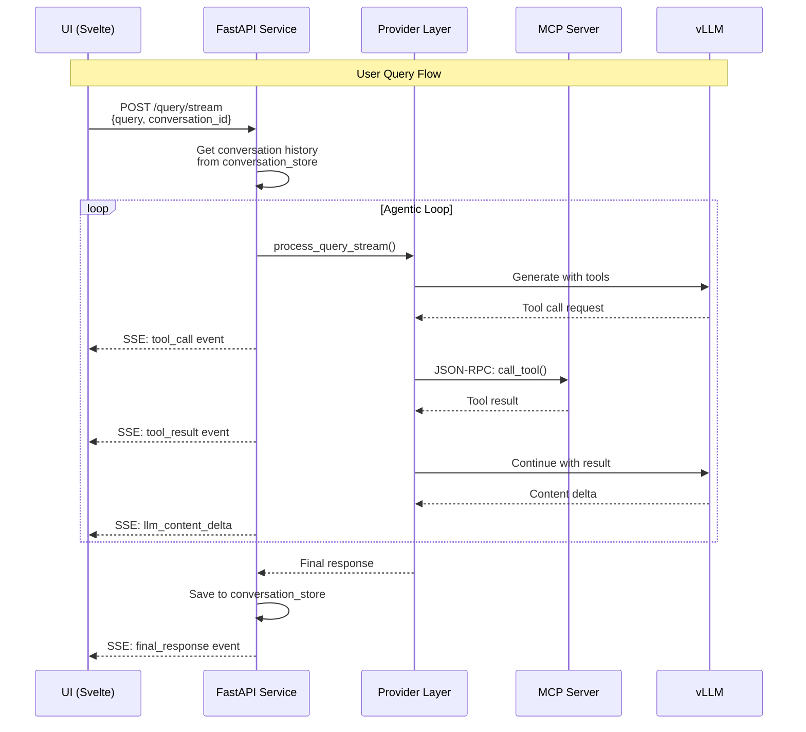
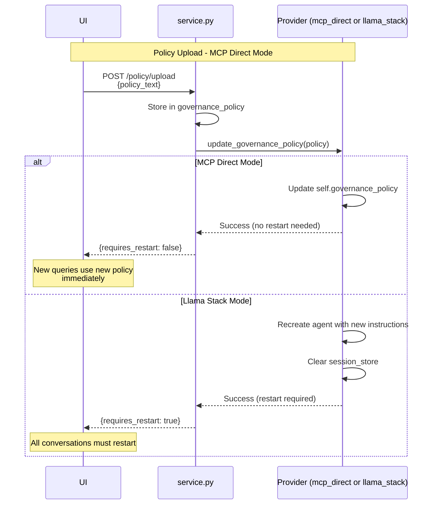
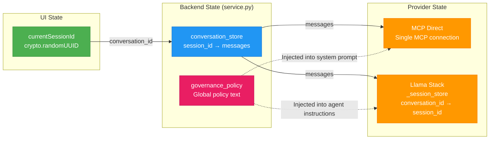
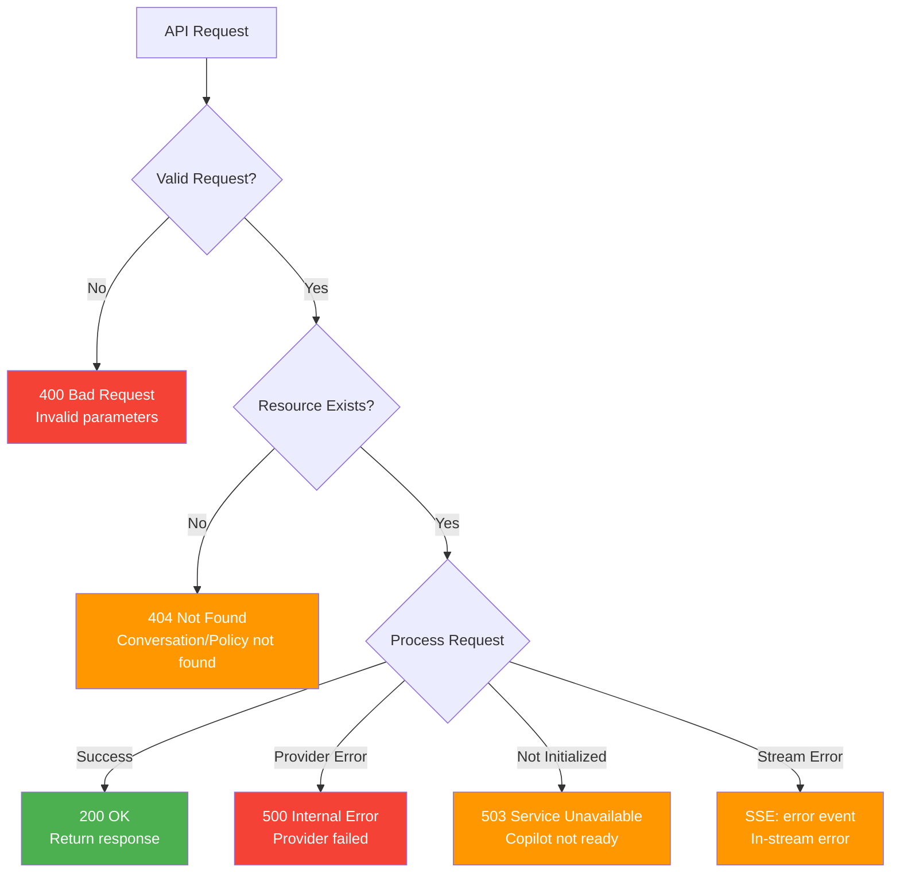

# Data Governance Copilot API - Visual Diagram

## REST API Endpoint Map



---

## Request Flow Diagram



---

## Policy Upload Flow



---

## Conversation State Management



---

## SSE Event Timeline

```mermaid
gantt
    title Query Processing Timeline (SSE Events)
    dateFormat  ss
    axisFormat  %Ss

    section Query
    query_start           :milestone, m1, 00, 0s

    section Iteration 1
    iteration_start       :milestone, m2, 00, 0s
    llm_thinking         :active, a1, 00, 2s
    tool_call (list_schemas) :crit, t1, 02, 1s
    tool_result          :milestone, m3, 03, 0s

    section Iteration 2
    iteration_start       :milestone, m4, 03, 0s
    tool_call (execute_sql)  :crit, t2, 03, 2s
    tool_result          :milestone, m5, 05, 0s

    section Final
    llm_content_delta    :active, a2, 05, 3s
    timing_summary       :milestone, m6, 08, 0s
    final_response       :milestone, m7, 08, 0s
```



---

## Error Handling Flow



---

## Endpoint Summary Table

| Category | Method | Endpoint | Auth | Streaming |
|----------|--------|----------|------|-----------|
| **Health** | GET | `/health` | ❌ | ❌ |
| **Health** | GET | `/provider/info` | ❌ | ❌ |
| **Query** | POST | `/query/stream` | ❌ | ✅ SSE |
| **Tools** | GET | `/tools` | ❌ | ❌ |
| **Conversations** | GET | `/conversations` | ❌ | ❌ |
| **Conversations** | DELETE | `/conversations/:id` | ❌ | ❌ |
| **Policy** | GET | `/policy/status` | ❌ | ❌ |
| **Policy** | POST | `/policy/upload` | ❌ | ❌ |
| **Policy** | DELETE | `/policy` | ❌ | ❌ |

**Total Endpoints**: 9

---

## Protocol Stack

```
┌─────────────────────────────────────┐
│         UI (Browser)                │
│      Svelte + TypeScript            │
└─────────────────────────────────────┘
              │
              │ HTTP/HTTPS + SSE
              ↓
┌─────────────────────────────────────┐
│      FastAPI (service.py)           │
│    REST + Server-Sent Events        │
└─────────────────────────────────────┘
              │
              │ Python API
              ↓
┌─────────────────────────────────────┐
│       Provider Layer                │
│  mcp_direct | llama_stack           │
└─────────────────────────────────────┘
          │           │
   JSON-RPC │         │ Llama Stack API
          │           │
    ┌─────▼───┐   ┌──▼──────┐
    │   MCP   │   │  Llama  │
    │ Server  │   │  Stack  │
    └─────────┘   └─────────┘
          │            │
          └────────────┘
                │
                │ OpenAI API
                ↓
         ┌────────────┐
         │    vLLM    │
         └────────────┘
```

---

**For full details**, see [API_ENDPOINTS.md](./API_ENDPOINTS.md)
