# Data Governance Copilot - System Architecture

## High-Level Container Diagram

### Overview - Simplified View

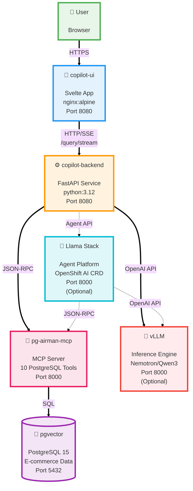

**Legend:**
- Solid arrows (==>) = Required connection
- Dashed arrows (-.->)  = Optional (Llama Stack mode only)

---

### Detailed Component Breakdown

#### 1️⃣ copilot-ui Pod

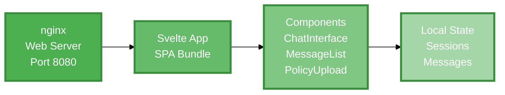

**Image:** `quay.io/rh-ai-quickstart/copilot-ui:latest`

---

#### 2️⃣ copilot-backend Pod

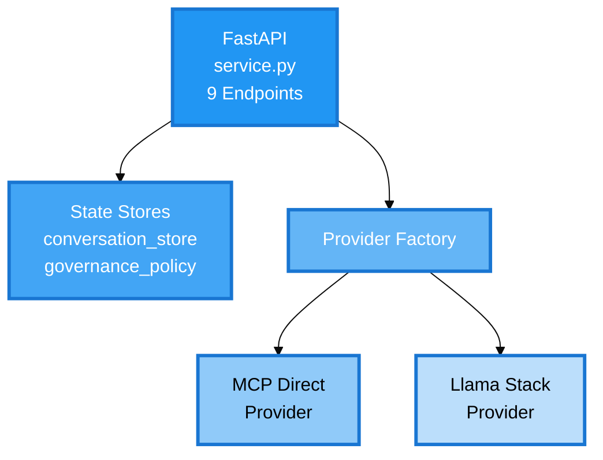

**Image:** `quay.io/rh-ai-quickstart/copilot-backend:latest`

---

#### 3️⃣ pg-airman-mcp Pod

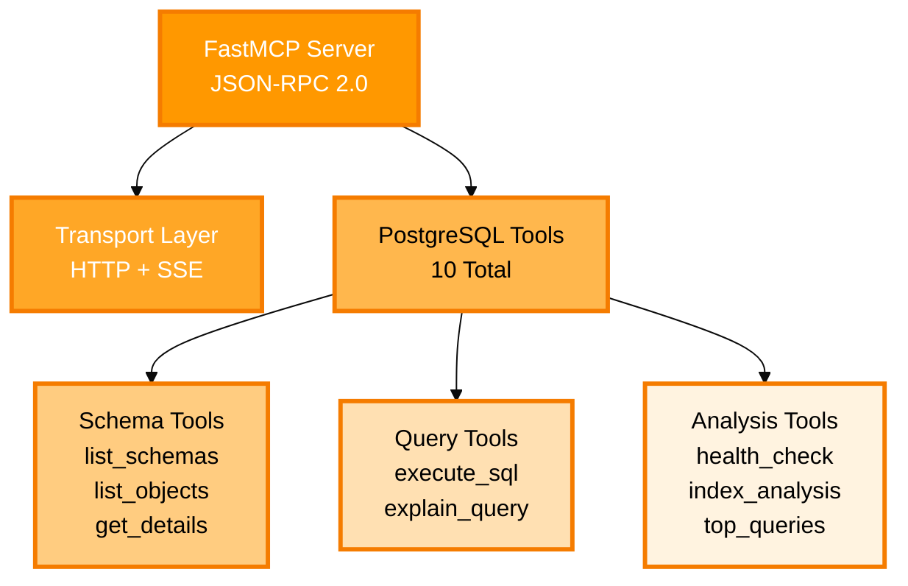

**Image:** `quay.io/rh-ai-quickstart/pg-airman-mcp:latest`

---

#### 4️⃣ pgvector Pod

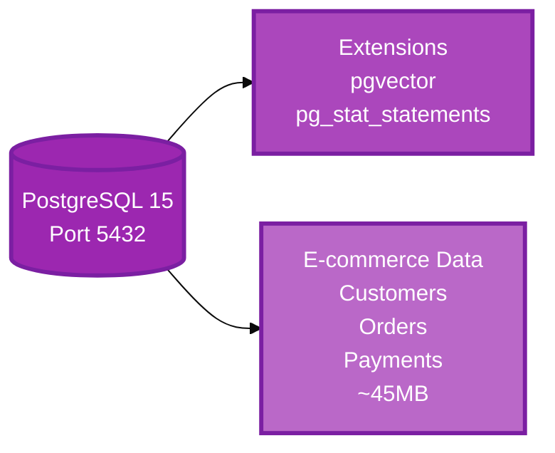

**Image:** `quay.io/enterprisedb/postgresql:15`

---

#### 5️⃣ vLLM Pod (Optional)

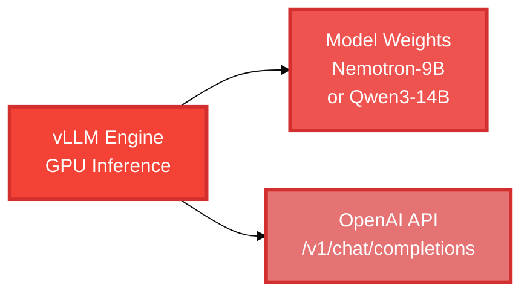

**Deployment:** KServe InferenceService via OpenShift AI

---

#### 6️⃣ Llama Stack Pod (Optional)

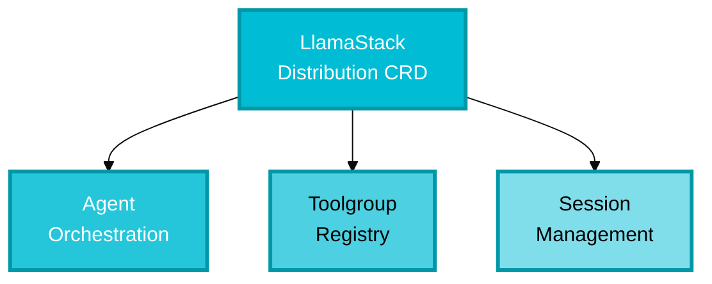

**Deployment:** LlamaStackDistribution CRD (OpenShift AI 3.2+)

---

## Deployment Modes

### Mode 1: MCP Direct (Default)

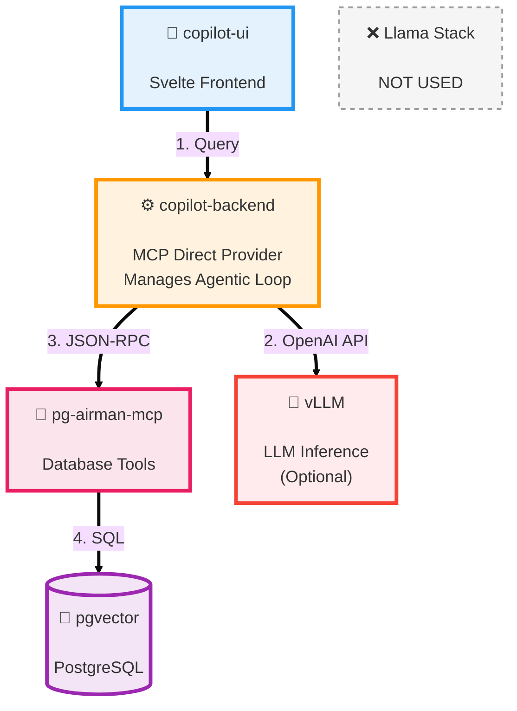

**Active Components:** 5
- ✅ copilot-ui
- ✅ copilot-backend (MCP Direct mode)
- ✅ pg-airman-mcp
- ✅ pgvector
- ✅ vLLM (optional)

**Inactive:**
- ❌ Llama Stack

**Orchestration:** Backend manages complete agentic loop

---

### Mode 2: Llama Stack

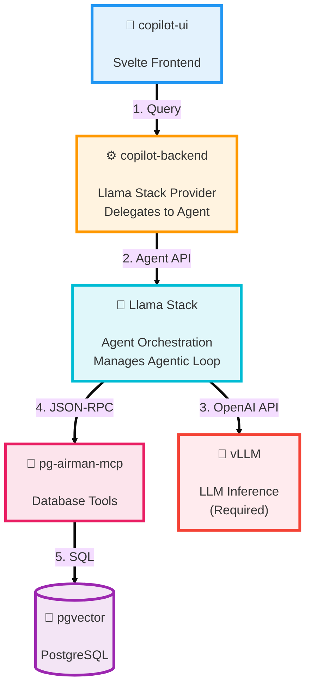

**Active Components:** 6 (all)
- ✅ copilot-ui
- ✅ copilot-backend (Llama Stack mode)
- ✅ Llama Stack
- ✅ pg-airman-mcp
- ✅ pgvector
- ✅ vLLM (required)

**Orchestration:** Llama Stack manages agentic loop

---

## Component Details

### 1. copilot-ui (Frontend Container)

**Image**: `quay.io/rh-ai-quickstart/copilot-ui:latest`  
**Base**: `nginxinc/nginx-unprivileged:alpine`  
**Port**: 8080 (HTTP)

**Components**:
```
copilot-ui/
├── nginx (Web Server)
├── Svelte App (SPA)
│   ├── ChatInterface.svelte    # Main chat UI
│   ├── MessageList.svelte      # Display messages
│   ├── ChatInput.svelte        # User input
│   ├── PolicyUpload.svelte     # Policy management
│   ├── ChatHistory.svelte      # Session history
│   └── config.js               # Runtime config (backend URL)
└── Static Assets
    ├── index.html
    ├── bundle.js
    └── bundle.css
```

**State**:
- `currentSessionId` - Active conversation UUID
- `messages[]` - Current conversation messages
- `chatSessions[]` - All conversation history (localStorage)

**External Dependencies**:
- Backend API via HTTP/SSE

---

### 2. copilot-backend (Backend Container)

**Image**: `quay.io/rh-ai-quickstart/copilot-backend:latest`  
**Base**: `python:3.12-slim`  
**Port**: 8080 (HTTP)

**Components**:
```
copilot-backend/
├── FastAPI Application (service.py)
│   ├── 9 REST endpoints
│   ├── SSE streaming
│   └── CORS middleware
├── State Management
│   ├── conversation_store        # In-memory message history
│   └── governance_policy         # Global policy text
├── Provider Layer
│   ├── factory.py                # Provider selection
│   ├── base.py                   # LLMProvider interface
│   ├── mcp_direct.py             # MCP Direct implementation
│   └── llama_stack.py            # Llama Stack implementation
└── Dependencies
    ├── fastapi
    ├── mcp[cli]                  # MCP SDK
    ├── llama-stack-client
    └── openai                    # For vLLM API
```

**State**:
- `conversation_store: dict[str, list[dict]]` - Conversation history
- `governance_policy: str | None` - Active policy
- Provider-specific:
  - MCP Direct: Single persistent MCP connection
  - Llama Stack: `_session_store` (conversation_id → session_id)

**Environment Variables**:
- `COPILOT_PROVIDER_MODE` - "mcp_direct" or "llama_stack"
- `LLM_BASE_URL` - vLLM endpoint
- `LLM_MODEL` - Model name
- `MCP_SERVER_URL` - pg-airman-mcp endpoint
- `LLAMA_STACK_BASE_URL` - Llama Stack endpoint (if applicable)

**External Dependencies**:
- pg-airman-mcp (JSON-RPC)
- vLLM (OpenAI API)
- Llama Stack (Llama Stack API) - optional

---

### 3. pg-airman-mcp (MCP Server Container)

**Image**: `quay.io/rh-ai-quickstart/pg-airman-mcp:latest`  
**Base**: `python:3.12-slim-bookworm`  
**Port**: 8000 (HTTP)

**Components**:
```
pg-airman-mcp/
├── FastMCP Server
│   ├── Transport: Streamable HTTP + SSE
│   └── Protocol: JSON-RPC 2.0
├── PostgreSQL Tools (10 total)
│   ├── Schema Discovery
│   │   ├── list_schemas           # List all schemas
│   │   ├── list_objects           # List tables/views/etc
│   │   └── get_object_details     # Table schema + comments
│   ├── Query Execution
│   │   ├── execute_sql            # Read-only SQL
│   │   └── explain_query          # Query plan analysis
│   ├── Performance Analysis
│   │   ├── analyze_workload_indexes    # Index recommendations
│   │   ├── analyze_query_indexes       # Query-specific indexes
│   │   └── get_top_queries             # Slow query analysis
│   ├── Health Monitoring
│   │   └── analyze_db_health      # Database health checks
│   └── Governance
│       └── add_comment_to_object  # Add metadata comments
└── PostgreSQL Client
    └── psycopg2 connection pool
```

**Patches Applied** (for OpenShift/Llama Stack):
1. DNS rebinding protection disabled
2. `list_schemas` noop parameter workaround

**Environment Variables**:
- `POSTGRES_HOST` - Database host
- `POSTGRES_PORT` - Database port (5432)
- `POSTGRES_USER` - Database user
- `POSTGRES_PASSWORD` - Database password
- `POSTGRES_DATABASE` - Database name

**External Dependencies**:
- PostgreSQL database

---

### 4. pgvector (Database Container)

**Image**: `quay.io/enterprisedb/postgresql:15`  
**Port**: 5432 (PostgreSQL)

**Components**:
```
pgvector/
├── PostgreSQL 15
├── Extensions
│   ├── pgvector                  # Vector similarity search
│   └── pg_stat_statements        # Query performance tracking
├── Sample Data (E-commerce)
│   ├── olist_customers_dataset.csv       (~45MB)
│   ├── olist_orders_dataset.csv
│   ├── olist_order_items_dataset.csv
│   └── olist_order_payments_dataset.csv
└── Schemas
    └── public
        ├── olist_customers (table)
        ├── olist_orders (table)
        ├── olist_order_items (table)
        └── olist_order_payments (table)
```

**Data Volume**: ~45MB CSV data  
**Initial Load**: Kubernetes Job (data-loader)

**Storage**:
- PersistentVolumeClaim for data directory

---

### 5. vLLM (LLM Inference Container - Optional)

**Image**: Custom (via KServe InferenceService)  
**Base**: `vllm/vllm-openai:latest`  
**Port**: 8000 (HTTP)

**Components**:
```
vLLM/
├── vLLM Engine
│   ├── Model loading
│   ├── Tensor parallelism
│   ├── PagedAttention
│   └── Continuous batching
├── OpenAI-Compatible API
│   ├── /v1/chat/completions     # Chat API
│   ├── /v1/completions          # Completion API
│   └── /v1/models               # Model info
└── Model Weights
    ├── Nemotron-9B (NVIDIA) OR
    └── Qwen3-14B-AWQ (Qwen)
```

**Configuration** (via vLLM args):
- `--served-model-name` - Model identifier
- `--max-model-len` - Context window (32768)
- `--enable-auto-tool-choice` - Tool calling support
- `--tool-call-parser` - "nemotron" or default
- `--chat-template` - Model-specific format

**GPU Requirements**:
- Nemotron-9B: 1x NVIDIA A10 (24GB) minimum
- Qwen3-14B-AWQ: 1x NVIDIA A10 (24GB) minimum

**External Dependencies**: None (self-contained)

---

### 6. Llama Stack (Agent Orchestration - Optional)

**Deployment**: LlamaStackDistribution CRD (OpenShift AI)  
**Version**: 0.3.5.1+rhai0  
**API Version**: llamastack.io/v1alpha1

**Components**:
```
Llama Stack/
├── Distribution Controller
│   └── Manages agent lifecycle
├── Agent Runtime
│   ├── Agent creation
│   ├── Session management
│   └── Turn execution
├── Toolgroup Registry
│   ├── MCP endpoint registration
│   └── Tool discovery
└── Provider APIs
    ├── Inference API → vLLM
    ├── Tool Runtime API → MCP
    └── Memory API (sessions)
```

**Resources Managed**:
- Agents (with instructions + toolgroups)
- Sessions (conversation state)
- Toolgroups (MCP tools)

**External Dependencies**:
- vLLM (required)
- pg-airman-mcp (required)

---

## Network Communication

### Protocols Used

| Source | Target | Protocol | Port | Purpose |
|--------|--------|----------|------|---------|
| Browser | copilot-ui | HTTPS | 443 | UI access |
| copilot-ui | copilot-backend | HTTP + SSE | 8080 | API calls |
| copilot-backend | pg-airman-mcp | JSON-RPC (HTTP) | 8000 | Tool execution |
| copilot-backend | vLLM | OpenAI API (HTTP) | 8000 | LLM inference |
| copilot-backend | Llama Stack | Llama Stack API | 8000 | Agent delegation |
| Llama Stack | pg-airman-mcp | JSON-RPC (SSE) | 8000 | Tool execution |
| Llama Stack | vLLM | OpenAI API (HTTP) | 8000 | LLM inference |
| pg-airman-mcp | pgvector | PostgreSQL | 5432 | SQL queries |

---

## Data Flow: User Query

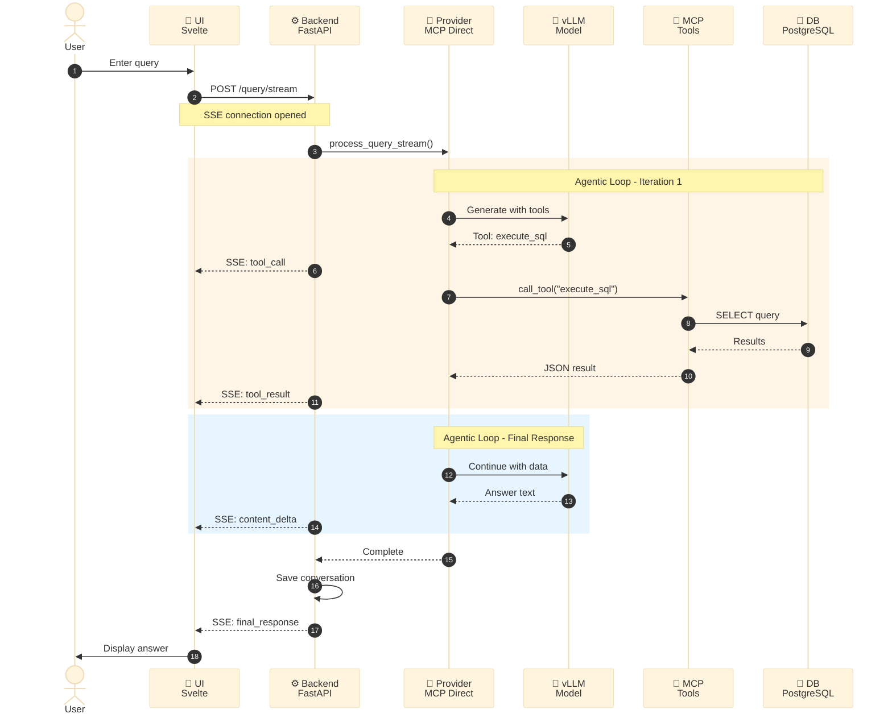

---

## Deployment Topology

### OpenShift Resources

```
Namespace: <user-namespace>
│
├── Deployments
│   ├── copilot-ui (1 replica)
│   ├── copilot-backend (1 replica)
│   ├── pg-airman-mcp (1 replica)
│   └── postgres (1 replica)
│
├── Services
│   ├── copilot-ui-service (ClusterIP:8080)
│   ├── copilot-backend-service (ClusterIP:8080)
│   ├── pg-airman-mcp-service (ClusterIP:8000)
│   └── postgres-service (ClusterIP:5432)
│
├── Routes
│   ├── copilot-ui (HTTPS, edge termination)
│   └── copilot-backend (optional, for debugging)
│
├── ConfigMaps
│   ├── copilot-ui-config (config.js)
│   └── postgres-init-scripts
│
├── Secrets
│   ├── postgres-credentials
│   └── llm-api-key (if external LLM)
│
├── PersistentVolumeClaims
│   └── postgres-data (10Gi)
│
├── Jobs
│   └── pgvector-data-loader (runs once)
│
├── InferenceServices (if DEPLOY_MODEL=true)
│   ├── nemotron-model OR
│   └── qwen3-model
│
└── LlamaStackDistributions (if PROVIDER_MODE=llama_stack)
    └── copilot-llama-stack
```

---

## Scaling Characteristics

| Component | Scalable? | Bottleneck | Notes |
|-----------|-----------|------------|-------|
| copilot-ui | ✅ Horizontal | None | Stateless |
| copilot-backend | ⚠️ Limited | conversation_store in-memory | Need Redis for multi-replica |
| pg-airman-mcp | ✅ Horizontal | Database connections | Connection pooling |
| pgvector | ❌ Single | PostgreSQL replication | Primary-replica setup needed |
| vLLM | ✅ Vertical (GPU) | GPU memory | Tensor parallelism for large models |
| Llama Stack | ⚠️ Unknown | Session storage | Managed by operator |

---

## Security Boundaries

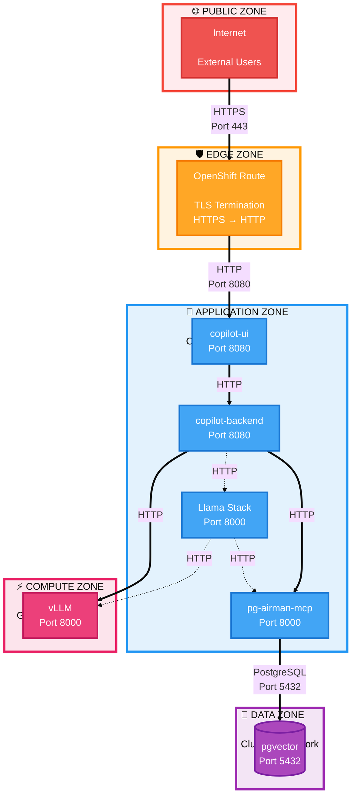

**Security Layers:**

| Zone | Trust Level | Components | Exposure |
|------|-------------|------------|----------|
| 🌐 **Public** | Untrusted | Internet | External |
| 🛡️ **Edge** | Border | OpenShift Route | TLS termination |
| 🏢 **Application** | Trusted | UI, Backend, MCP, Llama Stack | Internal only |
| 💾 **Data** | Highly Trusted | PostgreSQL | Internal only |
| ⚡ **Compute** | Trusted | vLLM (GPU) | Internal only |

**Current Security Posture:**
- ✅ TLS encryption at edge
- ⚠️ No authentication on API endpoints
- ⚠️ No authorization/RBAC
- ✅ Database credentials in Secret
- ✅ All internal services use ClusterIP (not exposed)

**Security Layers**:
1. **Ingress**: TLS termination at Route (edge)
2. **Application**: No authentication (add JWT/OAuth for production)
3. **Data**: Database credentials via Secret
4. **Network**: All internal communication over ClusterIP (not exposed)

---

## Configuration Matrix

| Component | Config Source | Runtime Configurable? |
|-----------|---------------|----------------------|
| copilot-ui | ConfigMap (config.js) | ✅ Yes (backend URL) |
| copilot-backend | Environment Variables | ✅ Yes (all params) |
| pg-airman-mcp | Environment Variables | ✅ Yes (DB connection) |
| pgvector | Environment Variables | ❌ No (requires restart) |
| vLLM | InferenceService args | ❌ No (model load time) |
| Llama Stack | LlamaStackDistribution spec | ⚠️ Partial (agent recreation) |

---

## Build vs. Pull Strategy

All components support two deployment modes:

### Pull from Quay (Default)
```yaml
BUILD_COPILOT_UI=false       # Default
BUILD_COPILOT_BACKEND=false  # Default
BUILD_PG_AIRMAN_MCP=false    # Default
BUILD_DATA_LOADER=false      # Default
```

**Benefits**:
- ✅ Faster deployment
- ✅ Less cluster compute
- ✅ Pre-tested images

### Build on Cluster
```yaml
BUILD_COPILOT_UI=true
BUILD_COPILOT_BACKEND=true
BUILD_PG_AIRMAN_MCP=true
BUILD_DATA_LOADER=true
```

**Benefits**:
- ✅ Custom modifications
- ✅ No external registry dependency
- ✅ Development workflow

**Mechanism**: OpenShift BuildConfig + ImageStream

---

## Resource Requirements

### Minimum Cluster

| Component | CPU | Memory | Storage | GPU |
|-----------|-----|--------|---------|-----|
| copilot-ui | 100m | 128Mi | - | - |
| copilot-backend | 500m | 512Mi | - | - |
| pg-airman-mcp | 250m | 256Mi | - | - |
| pgvector | 500m | 1Gi | 10Gi PVC | - |
| vLLM (Nemotron-9B) | 4000m | 16Gi | - | 1x A10 (24GB) |
| vLLM (Qwen3-14B) | 4000m | 16Gi | - | 1x A10 (24GB) |
| **Total (w/ LLM)** | **5.35 CPU** | **~18Gi RAM** | **10Gi** | **1 GPU** |

### Recommended Cluster

- **Worker Nodes**: 3+ nodes
- **GPU Nodes**: 1+ node with NVIDIA GPU
- **GPU Type**: NVIDIA A100 (40GB/80GB) or L40 (48GB)
- **RAM per Worker**: 64GB
- **OpenShift**: 4.20.14+
- **OpenShift AI**: 3.2+ (for Llama Stack mode)

---

**Last Updated**: 2026-04-16  
**Architecture Version**: 0.1.0
